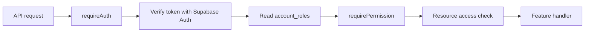

# Authorisation

The authorisation module verifies the caller, reads their role from the database,
and checks whether that role can perform an action. Backend routes use shared
middleware. Frontend pages use the permission list returned by the backend to
control which actions they display.

## Architecture



Each request carries a Supabase access token in the `Authorization` header.
`requireAuth` verifies it with `auth.getUser(token)`, then reads
`public.account_roles` using the verified user ID. It stores `{ userId, role }`
for that request. Request-body fields and user metadata do not determine access.

`requirePermission(action)` checks the role against the permission map in
[`policy.ts`](../server/src/auth/policy.ts). The feature handler is responsible
for access to the specific record, such as an event belonging to the caller's
organisation. Both checks must pass before the operation is performed.

The Supabase client is created per request. Role changes take effect on the next
request, without waiting for a new access token. Each outbound request has a
five-second timeout and rejects redirects.

| File | Purpose |
| --- | --- |
| [server/src/auth/index.ts](../server/src/auth/index.ts) | Middleware, router factory, and access-summary endpoint. |
| [server/src/auth/policy.ts](../server/src/auth/policy.ts) | Role types and permission map. |
| [server/src/auth/supabase.ts](../server/src/auth/supabase.ts) | Token verification and database role lookup. |
| [client/src/auth/access.ts](../client/src/auth/access.ts) | Page helpers for loading and checking permissions. |

## Setup

Configure these values in `server/.env`, using
[`server/.env.example`](../server/.env.example) as a template:

| Variable | Value |
| --- | --- |
| `SUPABASE_URL` | Supabase project HTTPS API URL. |
| `SUPABASE_ANON_KEY` | Publishable/anon API key. |

The auth module requires both values. It does not use the service-role key.

Apply [the account roles migration](../supabase/migrations/202609080001_account_roles.sql)
once to the target Supabase project. It creates `public.account_roles`:

| Column | Constraint |
| --- | --- |
| `user_id` | UUID primary key referencing `auth.users(id)`. |
| `role` | Required text value from the role list below. |

Create users through Supabase Auth, then assign each user a role through a
trusted database operation. For example, replace the UUID below with an existing
Auth user's ID before running the insert:

```sql
insert into public.account_roles (user_id, role)
values ('10000000-0000-4000-8000-000000000001', 'event_organiser');
```

Users without a role cannot access protected routes. The module does not create
accounts or expose an endpoint for changing roles.

## Roles and permissions

| Role | Stored value |
| --- | --- |
| Event Organiser | `event_organiser` |
| Event Coordinator | `event_coordinator` |
| Venue Staff | `venue_staff` |
| Technical Support Staff | `technical_support_staff` |
| Attendee | `attendee` |

Permissions map an action name to the roles allowed to perform it. Define them
in `PERMISSIONS` in `server/src/auth/policy.ts`. For example, a policy granting
event updates to organisers would look like this:

```ts
export const PERMISSIONS: PermissionMap = Object.freeze({
  'events.update': ['event_organiser']
});
```

This is a configuration example. The default map is empty. Actions without a
grant return `403`, including for Technical Support Staff. Use the same action
name in the backend guard and the page helper. Restart the backend after changing
the map; each module instance takes a copy of the policy when it starts.

## Protect a backend route

Import the shared `authorization` instance. `protectedRouter()` applies
identity verification to every route in the router; add `requirePermission()`
for each business operation.

Example router factory in `server/src/`:

```ts
import type { RequestHandler } from 'express';
import { authorization } from './auth';

export function createEventsRouter(updateEvent: RequestHandler) {
  const router = authorization.protectedRouter();
  router.patch(
    '/:eventId',
    authorization.requirePermission('events.update'),
    updateEvent
  );
  return router;
}
```

Mount the router in the application with the feature's handler:

```ts
app.use('/api/events', createEventsRouter(updateEvent));
```

Inside `updateEvent`, use `authorization.getPrincipal(req)` to read the verified
user ID and role. Check that user can access the requested event before reading
or updating it. A role grant does not establish ownership or organisation
membership.

For an existing Express router, use `router.use(authorization.requireAuth)`
before its routes. Use the same `authorization` instance for authentication,
permission checks, and principal lookup. A permission guard without a verified
principal returns `401`. Public health routes are mounted separately.

## Read the caller's access permissions

```http
GET /api/auth/me
Authorization: Bearer <access_token>
```

A user with a recognised database role receives:

```json
{
  "userId": "10000000-0000-4000-8000-000000000001",
  "role": "event_organiser",
  "permissions": []
}
```

`permissions` contains the actions granted by the server policy. The endpoint
returns `Cache-Control: no-store` and does not include tokens or user metadata.

| Status | Meaning |
| --- | --- |
| `200` | Access summary returned. |
| `401` | Missing, malformed, invalid, or expired credentials. Anonymous Supabase users are also refused. |
| `403` | Missing/unrecognised database role, or an action denied by a permission guard. |
| `503` | Auth configuration, provider, or database lookup failure. |

## Use permissions in a page

Call `loadAccess` with the access token from the login session. `can` checks the
returned permissions without duplicating the role map in the frontend.

```ts
import { loadAccess, can } from './auth/access';

const controller = new AbortController();
const access = await loadAccess(accessToken, controller.signal);
const showEditControl = can(access, 'events.update');
```

The import above is relative to a file in `client/src/`. `loadAccess` returns
`null` when no token is supplied or the server returns `401`/`403`. It throws on
network failures, other unsuccessful responses, or malformed data.
`can(null, action)` and `can(undefined, action)` return `false`.

Clear the page's access state before reloading and on logout or errors. Cancel
in-flight loads with `controller.abort()` when the page unmounts or the session
changes, and discard results belonging to an earlier session.

Send the current bearer token on the business request as well. The backend
checks permissions again, so pages must handle a denial even when a control was
visible. The helpers do not manage login, token refresh, or token revocation.

## Database access

RLS lets authenticated users read only their own `account_roles` row. Table
grants prevent them from inserting, updating, or deleting role assignments.
Privileged role changes belong in a separately authorised server operation.

Feature queries need their own RLS policies and a client carrying the caller's
access token. The auth module's client only reads roles. The existing
`getSupabaseClient()` health helper has a service-role fallback and must not be
used as a user-scoped data client.

Keep service-role credentials on the server. Since they bypass RLS, any operation
using them must perform its own access checks. Changes to a role during an
operation may require transaction-level checks; the initial role lookup alone
does not make a later write atomic.

## Tests

Run the application tests from the repository root:

```sh
npm test
npm run ci
```

[`server/src/authorization.test.ts`](../server/src/authorization.test.ts) covers
HTTP denials, allowed actions, forged role fields, provider failures and timeouts,
role changes, and concurrent callers. Supabase responses are mocked.
[`client/src/auth/access.test.ts`](../client/src/auth/access.test.ts) covers the
page helpers and error handling.

For isolated middleware tests, `createAuthorization({ resolvePrincipal,
permissions })` accepts a test identity resolver and permission map. Production
routes use the exported `authorization` instance.

Run [`supabase/tests/account_roles.sql`](../supabase/tests/account_roles.sql)
after the migration in a development database as the database operator. It
checks row visibility, blocked writes, role changes, and schema constraints,
then rolls back its fixtures. Run it through the SQL editor or `psql` with
`ON_ERROR_STOP=1` so a failed assertion stops execution.

Pull-request CI runs the SQL tests against a temporary PostgreSQL service as
part of **Build and test**. The [CI guide](ci.md) describes the database fixture
and required-check configuration.
